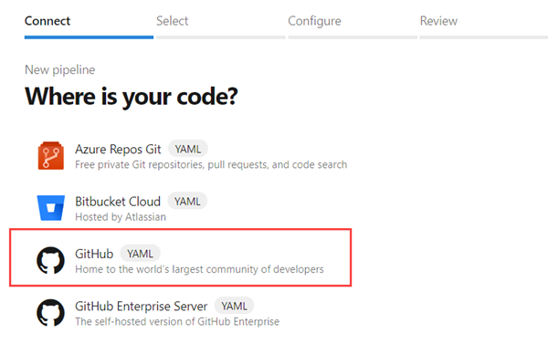

# Continuous integration in Azure Pipelines

In this step-by-step guide you'll learn how to use Azure Pipelines for building and pushing an image to Azure Container Registry. With each update made to the source control repository, an image is built and pushed to Azure Container Registry.

## Pre-requisites

* A GitHub account, where you can create a repository. If you don't have one, you can [create one for free](https://github.com).

* An Azure DevOps organization. If you don't have one, you can [create one for free](https://docs.microsoft.com/azure/devops/pipelines/get-started/pipelines-sign-up?view=azure-devops). (An Azure DevOps organization is different from your GitHub organization. Give them the same name if you want alignment between them.)

  If your team already has one, then make sure you're an administrator of the Azure DevOps project that you want to use.

* An Azure account. If you don't have one, you can [create one for free](https://azure.microsoft.com/free/).

## Get the code

Fork the following repository on GitHub:
```
https://github.com/MicrosoftDocs/azure-pipelines-canary-k8s
```

## Create a container registry

Sign in to the [Azure Portal](https://portal.azure.com/), and then select the [Cloud Shell](https://docs.microsoft.com/azure/cloud-shell/overview) button in the upper-right corner.

```azurecli-interactive
# Create a resource group
az group create --name myapp-rg --location eastus

# Create a container registry
az acr create --resource-group myapp-rg --name myContainerRegistry --sku Basic
```

## Sign in to Azure Pipelines

Sign in to [Azure Pipelines](https://azure.microsoft.com/services/devops/pipelines). After you sign in, your browser goes to `https://dev.azure.com/my-organization-name` and displays your Azure DevOps dashboard.

Within your selected organization, create a project. If you don't have any projects in your organization, you see a **Create a project to get started** screen. Otherwise, select the **New Project** button in the upper-right corner of the dashboard.

## Create service connections
[Service connections](https://docs.microsoft.com/azure/devops/pipelines/library/service-endpoints?view=azure-devops&tabs=yaml) are entities used in Azure Pipelines to connect to external resources.

1. Navigate to Project settings -> Pipelines -> Service connections.
2. Create a [Docker registry service connection](https://docs.microsoft.com/azure/devops/pipelines/library/service-endpoints?view=azure-devops#sep-docreg) associated with your container registry. Name it **acrServiceConnection**.

## Create the pipeline

### Connect and select repository

1. Sign in to your Azure DevOps organization and navigate to your project.

2. Go to **Pipelines**, and then select **New Pipeline**.

3. Walk through the steps of the wizard by first selecting **GitHub** as the location of your source code.

   > [!div class="mx-imgBorder"]
   > 
   > 
   > [!NOTE]
   > 
   > If this is not what you see, then [make sure the Multi-stage pipelines experience is turned on](https://docs.microsoft.com/azure/devops/project/navigation/preview-features?view=azure-devops).

4. You might be redirected to GitHub to sign in. If so, enter your GitHub credentials.

5. When the list of repositories appears, select your repository.

6. You might be redirected to GitHub to install the Azure Pipelines app. If so, select **Approve and install**.

7. When the **Configure** tab appears, choose **Starter pipeline**.

8. In Review tab, replace the contents of the pipeline YAML with the following snippet -

    ```YAML
    trigger:
    - master
    
    pool:
      vmImage: Ubuntu-16.04
    
    variables:
      imageName: azure-pipelines-k8s
    
    steps:
    - task: Docker@2
      displayName: Build and push image
      inputs:
        containerRegistry: acrSC
        repository: $(imageName)
        command: buildAndPush
        Dockerfile: app/Dockerfile
        tags: |
          $(Build.BuildId)
    ```

5. The commit that will create your new pipeline appears. Select **Save and run**.

6. If you want, change the **Commit message** to something like _Add pipeline to our repository_. When you're ready, select **Save and run** to commit the new pipeline into your repository, and then begin the first run of your new pipeline!

As your pipeline runs, select the build job to watch your pipeline in action.